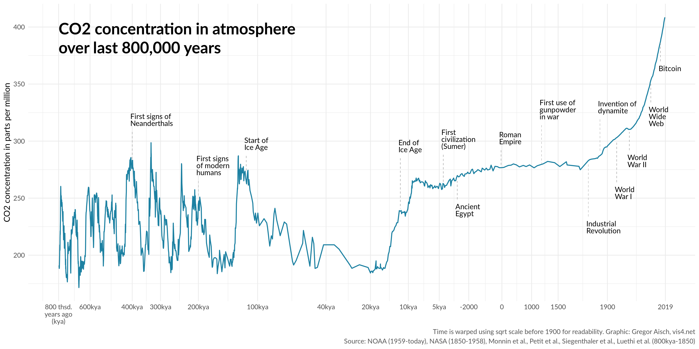

# co2-history

Carbon dioxide concentration in atmosphere over last 800,000 years

**data sources:**

- 800k-1800: https://media.nature.com/original/nature-assets/nature/journal/v453/n7193/extref/nature06949-s2.xls
- 1800-1850: https://www1.ncdc.noaa.gov/pub/data/paleo/icecore/antarctica/law/law_co2.txt (75 Year Smoothed)
- 1850-1958: http://data.giss.nasa.gov/modelforce/ghgases/Fig1A.ext.txt
- 1959-today: ftp://aftp.cmdl.noaa.gov/products/trends/co2/co2_annmean_mlo.txt

**see also:**
- https://www.sealevel.info/co2_and_ch4.html
- https://www.nature.com/articles/nature06949
